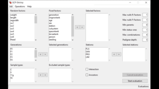

# GCP-Shrimp

<p align="center">
<a href=""></a> <a href=""></a>
</p>
<p align="center">
<a href=""></a>    <a href=""></a>
</p>

**GCP-Shrimp** is a graphical desktop application designed to manage and automate data processing for the genetic evaluation of the Ecuadorian white shrimp (*Penaeus vannamei*). It was specifically developed to support the operational needs of the ECUANARIA project.

## Folder Structure
```plaintext
📦 GCP-Shrimp/
├── 📁 conf/                       # Configuration file (config.yaml)
├── 📁 evaluation_input_files/     # Files generated for each evaluation (ddbb.txt, pedigree.prn, variables.txt, fvariables.txt)
├── 📁 input_data_files/           # Excel files used for loading new data
├── 📁 logs/                       # Log files (error.log, activity.log, outliers.log)
├── 📁 output_files/               # Exported lists of individuals and EBVs
├── 📁 results/                    # Evaluation results with timestamped subfolders
├── 📁 VCE/                        # Permanent copy of vce5.exe
└── 📁 temp_evaluation_process/    # Temporary folder for each evaluation run         
```

## Input Data Format

Input data must be provided as Excel files with predefined sheet names (configurable). The application classifies variables into three groups:

### Random Factors (morphological traits)
- `weight`, `length`, `segwidth`, `sw1`–`sw6`, `lhead`, `labdomen`, `whead`, `wabdomen`, `hhead`, `habdomen`, `cm3`, `cflength`, `cfwidth`, `deformity`, `sh1`–`sh6`, `sl1`–`sl6`, `wwmuscle`, `lipids`, `protein`, `mineral`, `moisture`, `unfrzleng`, `sv1`–`sv6`

### Fixed Factors (used for model correction)
- `generation`, `ongrowtank`, `age`, `sex`, `station`, `curlsystem`, `spawntank`, `larvaetank`, `person`, `seeding`, `selgroup`

### Meta Information
- `sample id` (required), `measured date`, `destine tank`, `ring code`, `sample num`, `observations`, `survival`, `selected`, `sample type`, `father code`, `mother code`


## Available Commands

### Data Management
- `load-data`: Load or update individual data
- `load-families`: Load or update mating information
- `check-pedigree`: Check pedigree before/after loading

### Evaluation
- `eval`: Run genetic evaluation using BLUP model
- `remove-eval`: Delete a stored evaluation

### Listings and Reports
- `list-individuals`: Show information of individuals
- `list-evals`: Show metadata of evaluations
- `list-ebvs`: List EBVs from evaluations
- `list-eval-nvce`: List assigned nVCEs and sample IDs
- `show-mates`: Show mating information
- `describe`: List variable descriptions
- `about`: Show application information

Each command supports multiple options and flags (e.g., `--help`, `--csv`, `--file-name`, etc.).

## Example Usage

```bash
# Load data from an Excel file with update and pedigree check
gcp-shrimp load-data "MyData.xlsx" --update --check-pedigree --comment "Initial load"

# Run a standard evaluation with selected factors and generations
gcp-shrimp eval --factors "weight,length,generation" --generations "F1,F2"

# Run an evaluation including ancestors and interaction model
gcp-shrimp eval --select-factors --ancestors --interaction

# List EBVs from an evaluation and export to CSV
gcp-shrimp list-ebvs EVAL12345 --csv --file-name "ebvs_eval12345.csv"

# List individuals and sort/export
gcp-shrimp list-individuals --generations "F2" --fields "sample id,weight,length" --ord-fields "length" --csv
````

## Accessing to GCP-Shrimp
For accessing to the latest version of ImaShrimp, please contact using this email [Juan Sebastián Ramírez Artiles](mailto:juan.ramirez@fpct.es).
